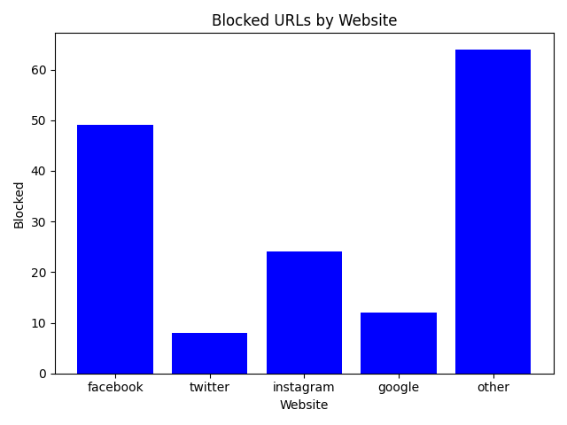

# DNS Blocker

This project uses [uv](https://github.com/astral-sh/uv) as a python package manager and virtual environment.

# References

Used scapy library.

The blacklist is downloaded from: <https://github.com/anudeepND/blacklist>

Dockerfile and docker-compose.yml inspired from the one provided in the courses.
